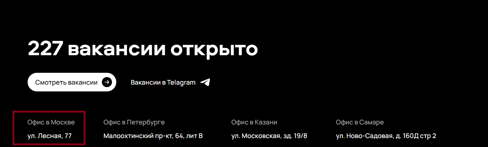
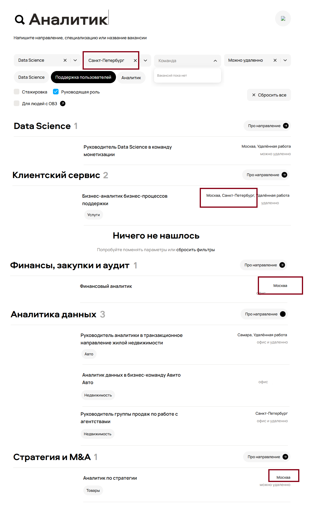
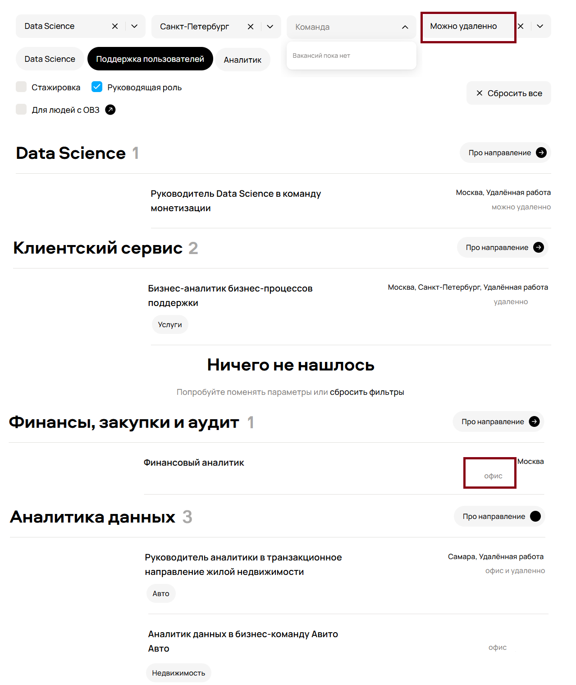
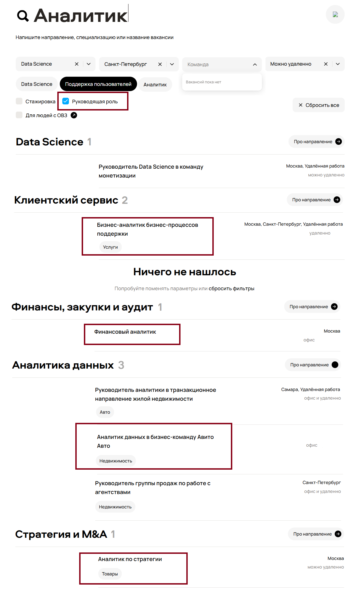
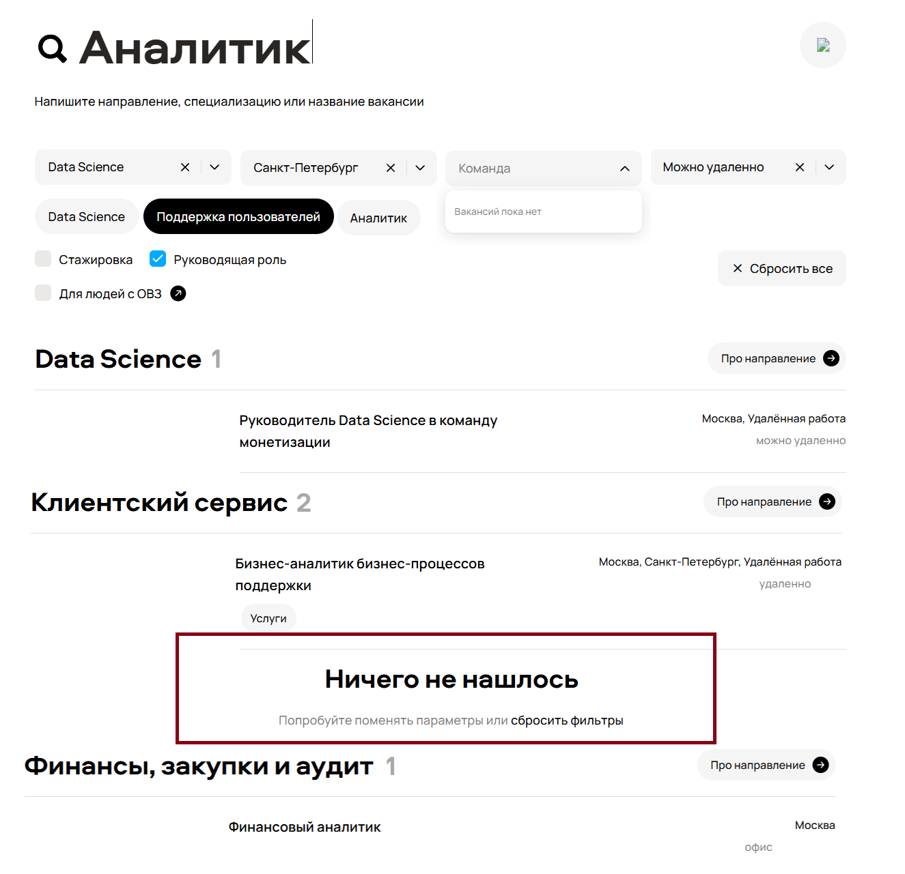
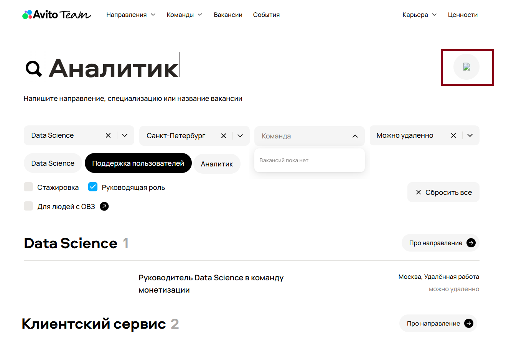
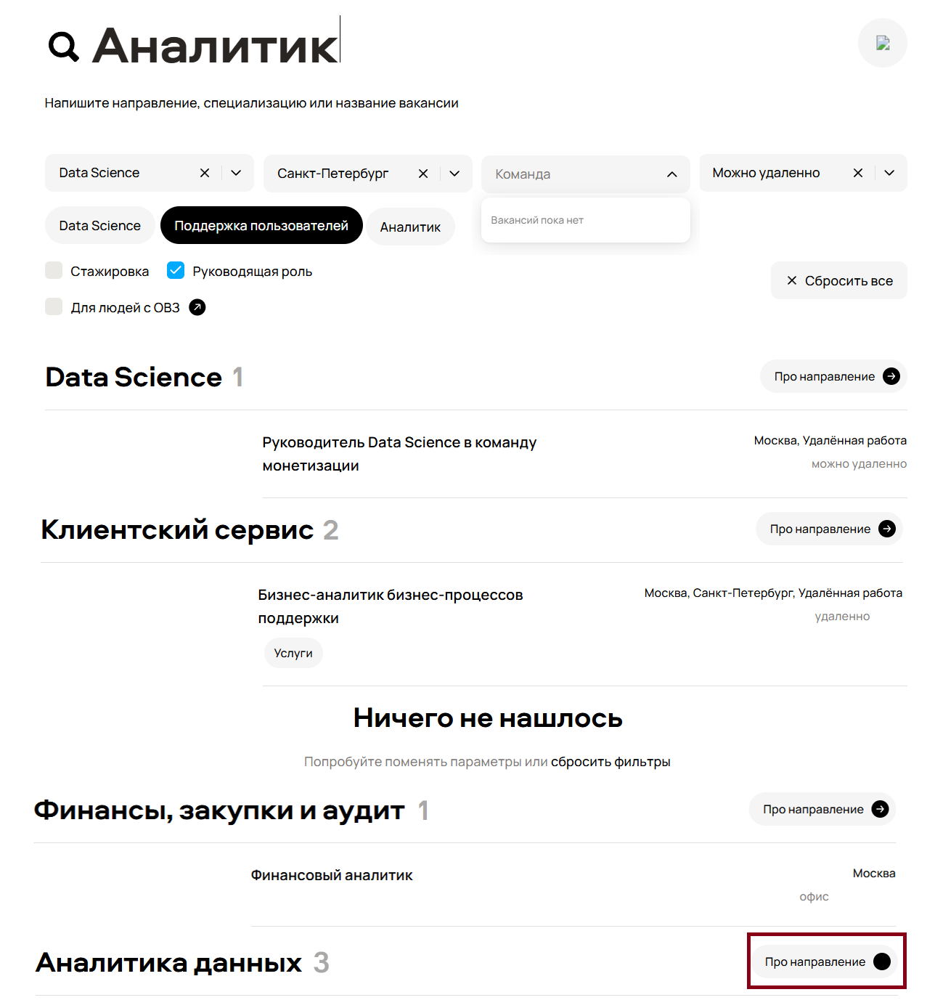
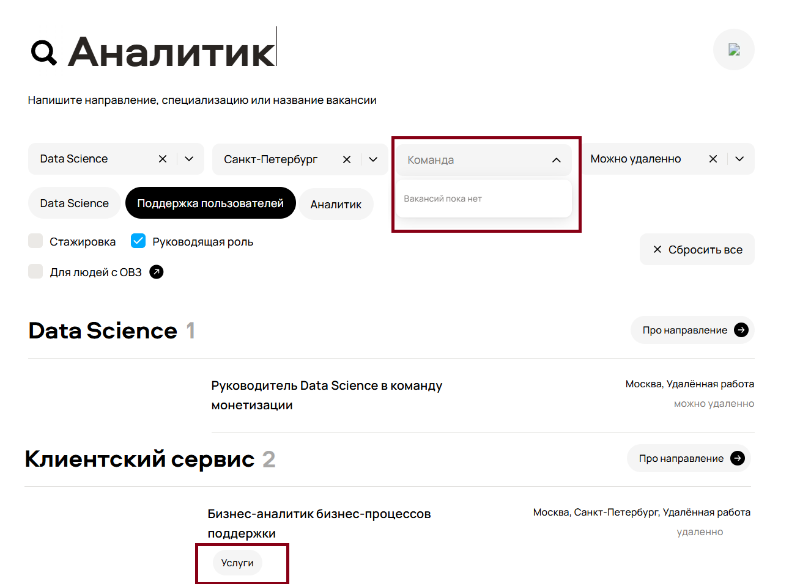
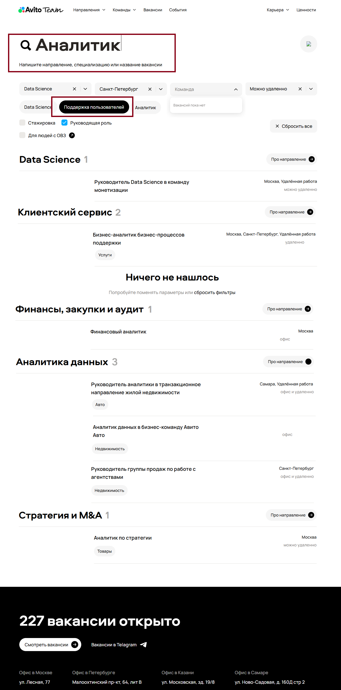
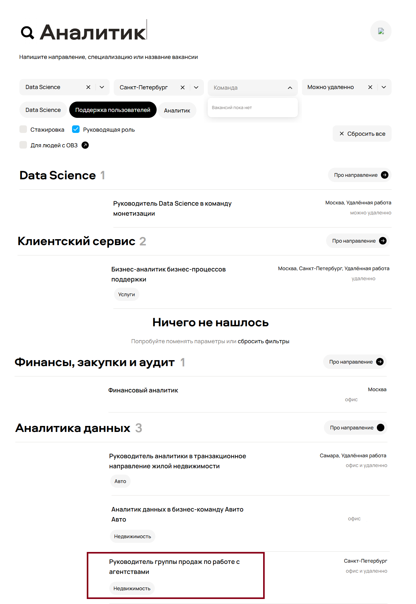

# **Bugs**

[Скриншот оригинала](https://github.com/avito-tech/tech-internship/raw/main/Tech%20Internships/QA/QA-trainee-assignment-autumn-2025/Bugs.png)  

---

**Bug-1**

**Заголовок:** Неверный адрес офиса в г. Москва

**Приоритет:** HIGH 

**Комментарий:** Неверная информация с адресом может ввести пользователя в заблуждение. Также есть репутационные риски.

---

**Bug-2**

**Заголовок:** Некорректная работа фильтра “Город”

**Приоритет:** HIGH

**Комментарий:** Один из главных фильтров при поиске вакансии, баг будет мешать пользователю искать вакансию в нужном городе.

---

**Bug-3**

**Заголовок:** Некорректная работа фильтра “Формат работы”

**Приоритет:** HIGH

**Комментарий:** В поисковой выдаче появляются вакансии где можно работать удаленно, также есть только работа в офисе, будет мешать пользователю искать работу в нужном формате.  

---

**Bug-4**

**Заголовок:** 

Некорректная работа чекбокса “Руководящая роль”

**Приоритет:**

HIGH

**Комментарий:**

В поисковой выдаче появляются вакансии не руководящей должности. Баг будет мешать пользователю искать именно руководящую роль.

---

**Bug-5**

**Заголовок:** 

“Ничего не нашлось” при выдаче результатов

**Приоритет:**

MEDIUM

**Комментарий:**

Баг будет вводить пользователя в заблуждение

---

**Bug-6**

**Заголовок:**

Некорректное отображение изображения в правом верхнем углу страницы

**Приоритет:**

LOW

**Комментарий:**

Визуальный баг, портит качество сайта

---

**Bug-7**

**Заголовок:**

Нет стрелки в кнопке “Про направление”

**Приоритет:**

LOW

**Комментарий:**

Визуальный баг, портит качество сайта

---

**Bug-8**

**Заголовок:**

Фильтр “Команда” показывает “Вакансий пока нет”

**Приоритет:**

MEDIUM

**Комментарий:**

Должны выпадать чекбоксы с командами, но их нет, хотя в поиске команды есть.

---

**Bug-9**

**Заголовок:**

Отображаются фильтры не относящиеся к выбранному направлению

**Приоритет:**

MEDIUM

**Комментарий:**

Вызывает непонимание у пользователя при поиске нужной вакансии.

---

**Bug-10**

**Заголовок:**

Неподходящие вакансии в результатах поисковой выдачи

**Приоритет:**

MEDIUM

**Комментарий:**

Мешает пользователю искать нужную вакансию в поисковой выдаче, но также есть подходящие запросы.  
